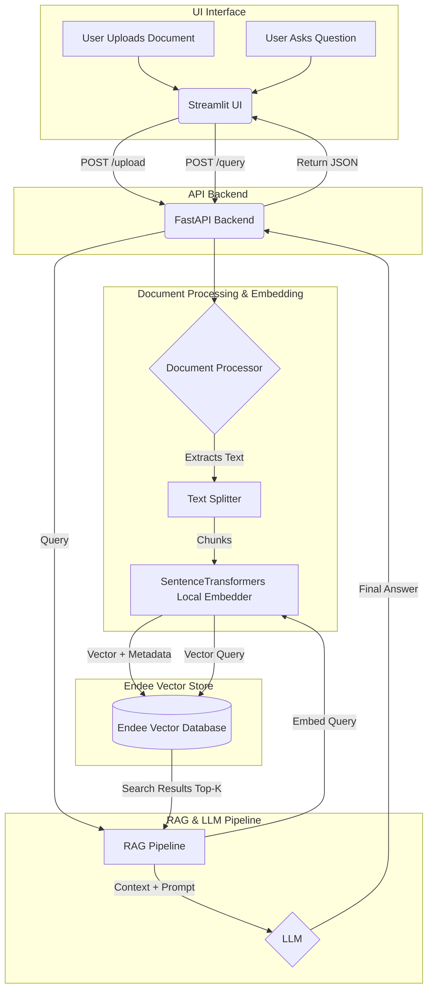

# 🚀 Endee RAG Application

An AI-powered Semantic Search and Retrieval Augmented Generation (RAG) system built using the **Endee Vector Database**, **FastAPI**, and **Streamlit**.

## 📑 Project Overview

This project demonstrates a real-world AI application where users can upload documents (PDF/Text) and ask questions in natural language. The system retrieves the most relevant document chunks using vector similarity from Endee, and generates a final comprehensive answer using an LLM. 

This repository was designed to evaluate capabilities in vector databases, semantic search, backend API engineering, and AI toolchains.

## 🎯 Problem Statement

Traditional keyword search fails to understand context and semantic meaning. Furthermore, static Large Language Models cannot answer questions on private or highly specific documents without fine-tuning. This project solves this by implementing an end-to-end RAG architecture with a high-performance vector database, guaranteeing accurate and context-aware natural language information retrieval.

## ✨ Features

- **Document Ingestion:** Upload PDF, Markdown, and TXT files.
- **Smart Chunking:** Automatic, overlap-aware text splitting using `RecursiveCharacterTextSplitter`.
- **Local Embedding Generation:** Utlizes `SentenceTransformers` (`all-MiniLM-L6-v2`) locally, keeping sensitive data processing private.
- **Vector Search:** Fast semantic retrieval powered by **Endee Vector Database**.
- **Dual Service Architecture:** Separation of concerns using a **FastAPI** robust backend and a **Streamlit** interactive UI.
- **Mock/Real LLM Toggle:** Can seamlessly switch between an OpenAI generated response (if an API key is provided) or a safe mock response for immediate demonstration.

## 🏗 System Architecture Diagram



## 🧠 How Endee Vector Database is used

In this application, Endee forms the core memory of the system:
1. **Creation:** We initialize a collection within Endee (`rag_collection`).
2. **Upsertion:** When a document is uploaded, it gets chunked and mapped to a 384-dimensional dense vector space. We call the `EndeeClient.upsert()` method to store these vectors alongside metadata (the original raw text of the chunk and the source filename).
3. **Retrieval (Semantic Search):** Upon a user query, the question is embedded into the same 384-dimensional space. `EndeeClient.query()` computes cosine similarity to locate the top *K* nearest embeddings. Endee retrieves our associated metadata, allowing precisely the matching source text to be routed to the contextual LLM.

## 🛠 Project Structure

```text
Endee_Assignment/
├── api/                
│   └── main.py              # FastAPI application & entrypoints
├── data/                    # Storage directory for uploads/dbs (if local Endee)
├── embeddings/        
│   └── embedder.py          # SentenceTransformers wrapping layer
├── rag_pipeline/      
│   └── generator.py         # The RAG orchestrator mapping Endee hits to LLMs
├── ui/                 
│   └── app.py               # Streamlit chat & document upload frontend
├── utils/              
│   └── document_processor.py# Logic for loading and chunking PDFs/Text
├── vector_store/       
│   └── endee_client.py      # Endee API instantiation and method wrappers
├── .env.example             # Template for API keys configuration
├── app.py                   # Runner script initializing API and UI simultaneously
├── requirements.txt         # Core dependencies
└── README.md                # This file
```

## ⚙️ Installation Instructions

### Prerequisites
- Python 3.9+
- An active Endee instance or API key (falling back to a local instance assuming Endee supports local mode natively).

### Setup

1. **Clone the repository:**
   ```bash
   git clone https://github.com/sudip-kumar-prasad/endee.git
   cd endee/rag_assignment
   ```

2. **Create a virtual environment:**
   ```bash
   python -m venv venv
   source venv/bin/activate  # On Windows: venv\Scripts\activate
   ```

3. **Install Dependencies:**
   ```bash
   pip install -r requirements.txt
   ```

4. **Environment Variables:**
   Copy `.env.example` to `.env` and fill in necessary information.
   ```bash
   cp .env.example .env
   ```
   *Note: If `OPENAI_API_KEY` is not provided, the application will default to a mock LLM output demonstrating the successful Endee lookup.*

## 🚀 How to run the project locally

You can run the full stack simultaneously using the application runner:

```bash
python app.py
```

This script will automatically boot the FastAPI backend on `http://localhost:8000` and the Streamlit UI on `http://localhost:8501`.

Alternatively, if you prefer to run them separately:
- **Terminal 1 (Backend):** `uvicorn api.main:app --host 0.0.0.0 --port 8000`
- **Terminal 2 (Frontend):** `streamlit run ui/app.py`

## 💡 Example Queries

1. Create a `sample.txt` file with content: *"The Endee Vector Database utilizes a proprietary Vector Graph Engine (VGE) which provides sub-5 millisecond query latency and horizontal scaling."*
2. Upload `sample.txt` through the sidebar in the Streamlit UI.
3. In the chat input, ask: **"What kind of engine does the Endee Database use?"**
4. Observe the LLM answering specifically using the retrieved context from the database!

## 📸 Screenshots

*(Placeholders for UI deployment screenshots)*

| Document Ingestion | Semantic Search QA |
|:---:|:---:|
| `[Screenshot of File Upload Sidebar]` | `[Screenshot of Chat Interface and Answer]` |

**Author:** Sudip Kumar Prasad
