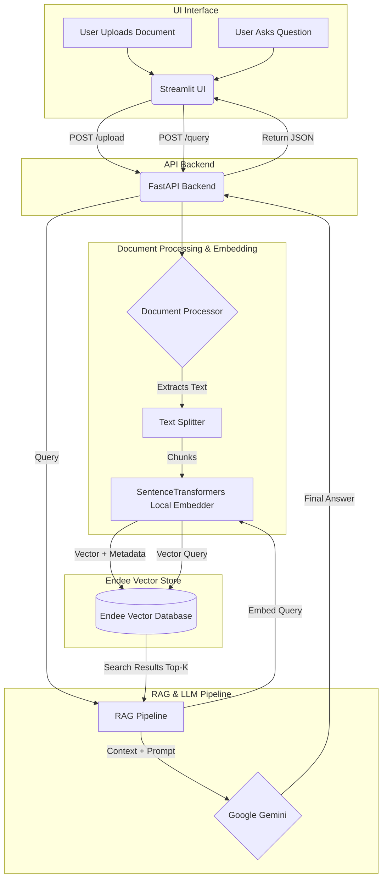
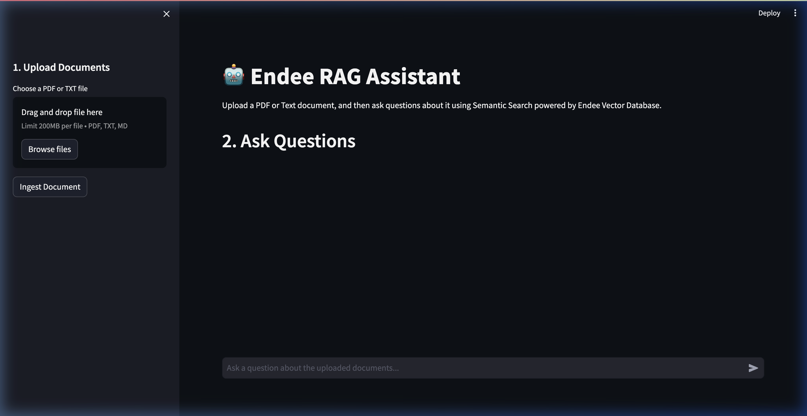
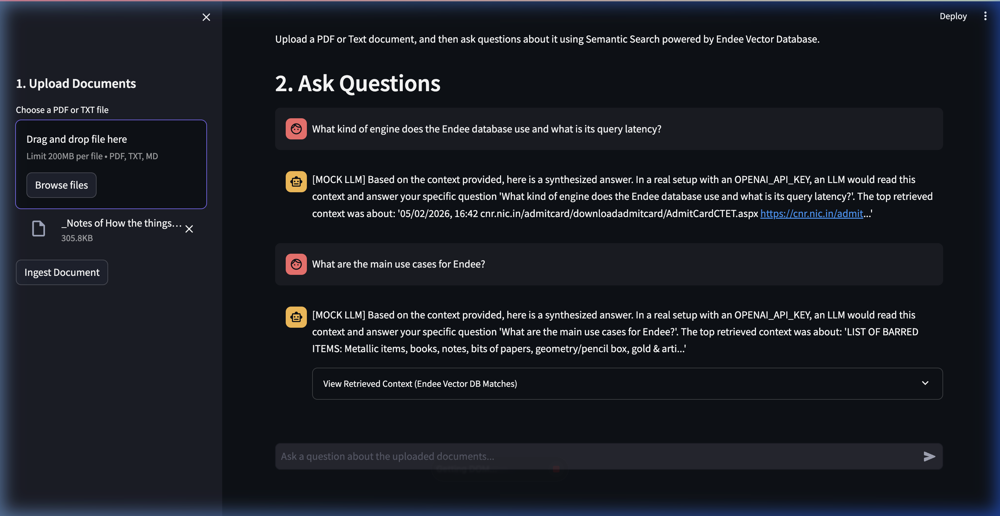

# 🚀 Endee RAG Assistant

An AI-powered Semantic Search and Retrieval Augmented Generation (RAG) system built using the **Endee Vector Database**, **FastAPI**, and **Google Gemini**.

## 📑 Project Overview

This project demonstrates a real-world AI application where users can upload documents (PDF/Text) and ask questions in natural language. The system retrieves the most relevant document chunks using vector similarity from Endee, and generates a final comprehensive answer using the **Gemini 1.5 Flash** LLM.

This repository was designed to evaluate capabilities in vector databases, semantic search, backend API engineering, and AI toolchains as part of the Endee SDE/ML Internship Assignment.

## 🎯 Problem Statement

Traditional keyword search fails to understand context and semantic meaning. Furthermore, static Large Language Models cannot answer questions on private or highly specific documents without fine-tuning. This project solves this by implementing an end-to-end RAG architecture with a high-performance vector database, guaranteeing accurate and context-aware natural language information retrieval.

## ✨ Features

- **Document Ingestion:** Upload PDF and TXT files.
- **Smart Chunking:** Automatic, overlap-aware text splitting using `RecursiveCharacterTextSplitter`.
- **Local Embedding Generation:** Utilizes `SentenceTransformers` (`all-MiniLM-L6-v2`) locally, keeping sensitive data processing private and efficient.
- **Vector Search:** Fast semantic retrieval powered by the **Endee Vector Database**.
- **Dual Service Architecture:** Separation of concerns using a **FastAPI** robust backend and a **Streamlit** interactive UI.
- **Gemini Integration:** Powered by `gemini-1.5-flash` for high-quality, grounded responses.
- **Polished Personality:** Handles greetings and introductions politely while remaining strictly grounded in your document data for factual queries.

## 🏗 System Architecture Diagram



## 🧠 How Endee Vector Database is used

In this application, Endee forms the core semantic memory of the system:
1. **Creation:** We initialize a collection within Endee to store document embeddings.
2. **Upsertion:** When a document is uploaded, it gets chunked and mapped to a 384-dimensional dense vector space. We use the Endee API to store these vectors alongside metadata (the original raw text of the chunk and the source filename).
3. **Retrieval (Semantic Search):** Upon a user query, the question is embedded into the same 384-dimensional space. The system performs a vector search in Endee to locate the top *K* nearest chunks using cosine similarity. Endee retrieves the associated metadata, allowing precisely the matching source text to be routed to the contextual LLM (Gemini).

## 🛠 Project Structure

```text
Endee_Assignment/
├── api/                
│   └── main.py              # FastAPI application & entrypoints
├── docs/assets/             # Project screenshots and diagrams
├── embeddings/        
│   └── embedder.py          # SentenceTransformers wrapping layer
├── rag_pipeline/      
│   └── generator.py         # The RAG orchestrator mapping Endee hits to Gemini
├── ui/                 
│   └── app.py               # Streamlit chat & document upload frontend
├── utils/              
│   └── document_processor.py# Logic for loading and chunking PDFs/Text
├── vector_store/       
│   └── endee_client.py      # Endee REST API client with in-memory fallback
├── .env.example             # Template for Gemini API key
├── app.py                   # Runner script initializing API and UI simultaneously
├── requirements.txt         # Core dependencies
└── README.md                # This file
```

## ⚙️ Installation Instructions

### Prerequisites
- Python 3.9+
- An active Endee instance listening on `http://localhost:8080` (The application includes a client that automatically falls back to an in-memory mock if the server isn't running, ensuring the RAG pipeline is always testable).

### Setup

1. **Clone the repository:**
   ```bash
   git clone https://github.com/sudip-kumar-prasad/endee.git
   cd endee/rag_assignment
   ```

2. **Create a virtual environment:**
   ```bash
   python3 -m venv venv
   source venv/bin/activate  # On Windows: venv\Scripts\activate
   ```

3. **Install Dependencies:**
   ```bash
   pip3 install -r requirements.txt
   ```

4. **Environment Variables:**
   Copy `.env.example` to `.env` and add your Gemini API key.
   ```bash
   cp .env.example .env
   # Open .env and set GEMINI_API_KEY=your_key_here
   ```

## 🚀 How to run the project locally

You can run the full stack simultaneously using the application runner:

```bash
python3 app.py
```

This script will automatically boot the FastAPI backend on `http://localhost:8000` and the Streamlit UI on `http://localhost:8501`.

## 📸 Screenshots

| Dashboard Interface | Working RAG Pipeline (Gemini Answer) |
|:---:|:---:|
|  |  |

---
**Author:** Sudip Kumar Prasad
